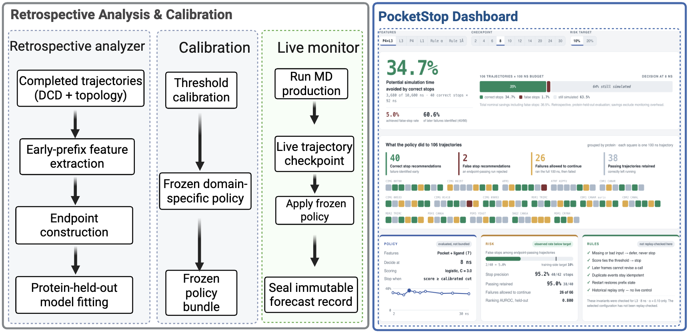
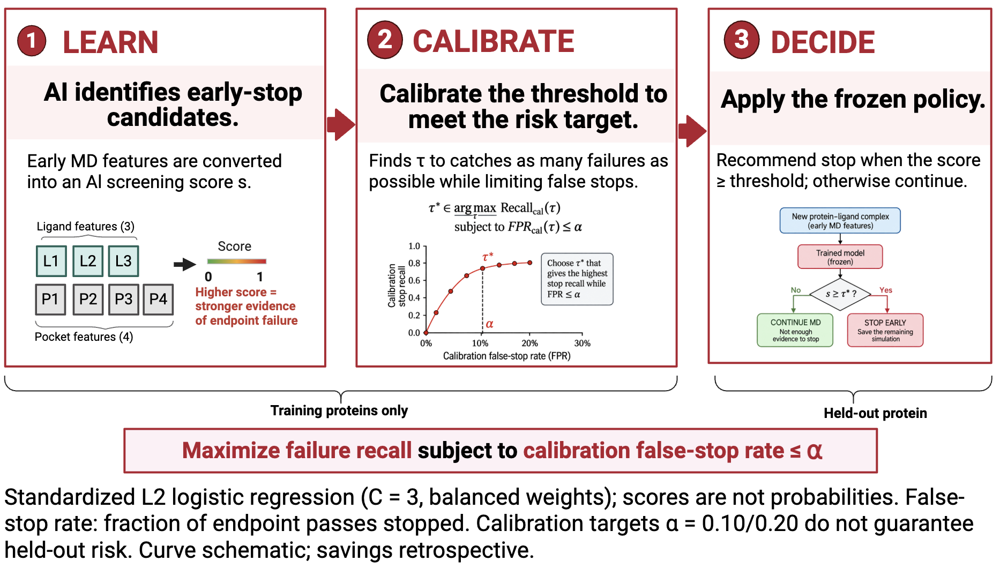
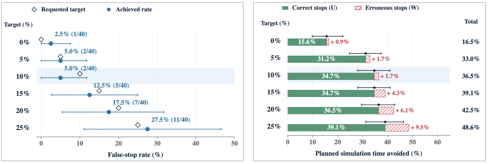

# PocketStop

A Risk-Aware AI Framework for Early Molecular-Dynamics Screening.

**Research question:** Can early molecular dynamics identify runs that will fail a 100 ns screening endpoint without prematurely rejecting runs that would pass?



## AI Innovation

Risk-aware AI learns from early ligand and pocket motion, calibrates stop/continue recommendations to a requested false-stop target, and evaluates computational savings from correct stops alongside preservation of endpoint-passing trajectories.

## Methodology — AI-Guided Screening



A versioned policy interface for risk-aware early-stopping decisions on molecular-dynamics screening trajectories, plus a historical-prefix replay engine for testing that a fitted model's retrospective evaluation and its deployed decision path agree exactly: historical-replay and deployment policy bundles, a checkpoint-bounded prefix reader, a sequential replay engine, and an append-only event log. **No OpenMM integration, no live pilot.** Those are separate, later work that needs a real simulation environment and explicit sign-off this package does not assume.

## Key Contributions

- **Risk-aware AI:** stop-or-continue decisions under a specified false-stop target, audited on held-out proteins.
- **Reproducible recommendations:** versioned policies preserve features, checkpoint, model, threshold, and decision provenance.

## Key Results: Maximize Compute Savings Within a Risk Limit

At 8 ns, with a 10% requested false-stop target and protein-held-out evaluation:

**Achieved false-stop rate: 5.0% → 60.6% of later failures identified → 34.7% of planned time saved.**



| Metric | 8 ns | 12 ns | 14 ns |
| --- | --- | --- | --- |
| AUROC | 0.800 | 0.851 | 0.827 |
| Saving | 34.7% | 30.7% | 31.6% |

- **Set the risk target.** At 8 ns, the policy selects the most aggressive stopping threshold allowed by the requested false-stop target.
- **Raising the target can add errors without adding benefit.** From 10% to 15%, correct-stop savings stay at 34.7%, while false stops increase from 2 to 5.
- **Practical lesson.** More time avoided does not necessarily mean better screening.

## Usage

From this repo's root:

```bash
# regenerate policy bundles (historical + deployment) from the frozen L3/8ns/alpha=0.10 spec
venv/bin/python -m pocketstop.export_bundles --out-dir pocketstop_bundles

# run the replay-parity acceptance tests (plain-assert script, not pytest)
venv/bin/python -m pocketstop.tests.test_replay_parity
```
